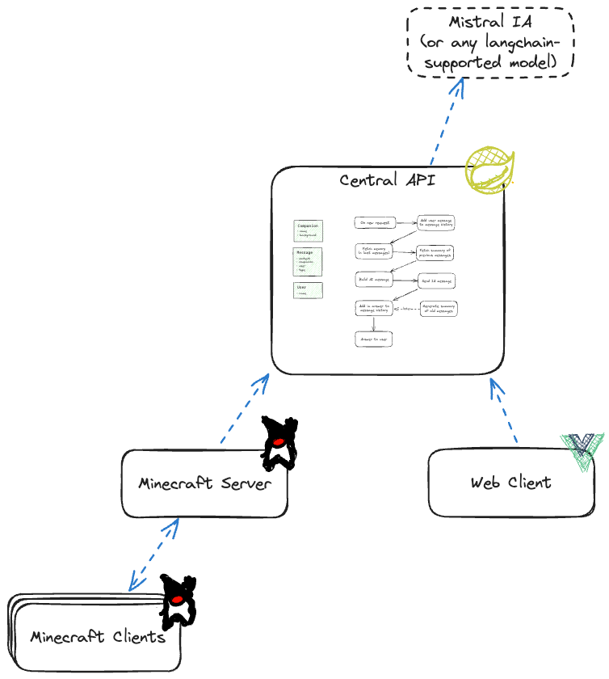
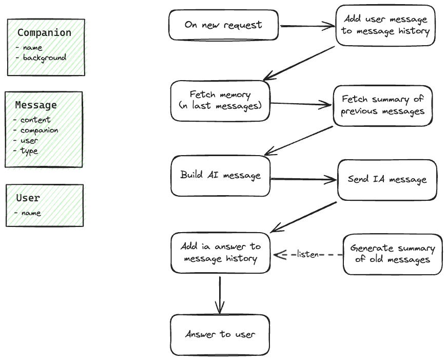

# :construction: This is a POC :construction:

*This project comes alongside an article that I am still currently writing, here is its introduction:*
> A few weeks ago, I started playing on a Minecraft server. To have a new player-experience, I searched for new mods and
> I came across the Neighborly mod. Neighborly is a really nice mod where you have some "friends" in your world. they all
> have a uniq personality and we can interact with them by giving them gifts or building them a house.
> I had a lot of fun playing with this mod but after a while, I found all of them and built a house for each one and the
> fun kinda stopped. That's when I had an idea.
>
>Everyone speaks about LLMs and artificial intelligence in general. They offer endless possibilities and the ecosystem
> around them was growing. What about using them to manipulate the entities of the Neighborly mod ? so the big question
> was: Can IA be creative enough to interpret a character with a uniq personality and how ?

I used this repo to test stuffs. Lately I used it to play with Langchain.

## Repositories: 
*I will migrate to a monorepo soon*

- [API](https://github.com/Anthony-Jhoiro/talk-with-me_api) (SpringBoot3 / Java21)
- [WebClient](https://github.com/Anthony-Jhoiro/talk-with-me_web-client) (Nuxt3)
- Some other repos but too ugly to be public **yet**

## App architecture

## Software architecture
The software architecture is bad, I was testing new things and kinda got lost.
It surely can be improved.
## Currently, I can:

- Create a new companion with a background
- Have a conversation with a companion that will have a personality based on the background
- History is persisted
- A summary is created from the history to avoid sending the history for each request

### Dialog flow

## Next steps:

- Integrate all repos in a monorepo (probably maven since it's mostly Java but ideally this will be used by a Minecraft
  mod so also probably gradle and I really like NX so probably NX)
- Implement the CRUD on the web-client side.
- Add auth (probably with Auth0)
- Deploy (Idk where yet, but I'll probably just provide the docker images and a docker-compose file)
- Finishing the article on the subject
- A lot more, I have a lot of ideas on this subject
